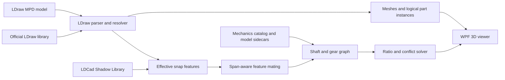

# TechnicsSimulator

TechnicsSimulator is an experimental kinematic simulator for LEGO Technic models stored in the [LDraw](https://www.ldraw.org/) format.

Most LDraw applications stop at rendering. This project aims to go further: infer axles, bearings, keyed connections, shafts, and gear meshes from model geometry, then propagate rotation through the reconstructed drivetrain with explainable gear ratios.

> [!IMPORTANT]
> The project is currently in the research and design phase. The models, technical audit, and implementation plan are present, but there is not yet a runnable application.

## Project goals

The first useful release will:

- Load and render the three supplied MPD models efficiently.
- Inspect logical parts, connection features, shafts, bearings, and candidate gear meshes.
- Explain where each inferred connection came from and how confident it is.
- Let the user choose a driving shaft or motor output.
- Animate reviewed rotary gear paths with exact, auditable ratios.
- Clearly identify ambiguous and unsupported mechanisms instead of silently guessing.

This is initially a **kinematic** simulator. It will model positions and velocity relationships, not mass, torque, friction, gravity, backlash, or material deformation.

## How it is intended to work



LDraw type-1 references contain transforms and geometry names, but they do not say which axle drives which gear. The [LDCad Shadow Library](https://github.com/RolandMelkert/LDCadShadowLibrary) adds snapping metadata for many official parts. TechnicsSimulator will combine that metadata with a reviewed mechanics catalog and optional per-model corrections.

Automatic inference is deliberately conservative. For example, an axle-shaped shaft in an axle-shaped hole is a high-confidence keyed connection, while a round pin in a round hole may be either structural or an intentional hinge.

## Supplied models

The repository includes three LDraw MPDs in [Models/](Models/):

| Model | MPD sections | Source type-1 lines | Expanded logical parts | Notable mechanisms |
| --- | ---: | ---: | ---: | --- |
| 8275 Motorized Bulldozer | 157 | 3,021 | 3,029 | Two motors, gears, worm, clutches, universal joints, sprockets, tracks |
| 8458 Silver Truck (B) | 29 | 2,093 | 2,068 | Gears, differential, racks, steering, suspension |
| 8458 Street Sensation (Web) | 50 | 2,289 | 2,240 | Gears, differential, racks, generated hoses and springs |

The distinction between source lines and logical parts matters. The 8275 MPD embeds an unofficial LS70 track-link part and uses it 1,630 times. Recursively expanding that part's rendering primitives produces tens of thousands of references, but those primitives are not separate LEGO parts.

## MVP scope

Planned for the first release:

- LDraw MPD/LDR/DAT parsing and library resolution.
- Solid rendering, colors, BFC handling, caching, instancing, and part selection.
- LDCad shadow overlay and inherited snap-feature extraction.
- Axial-span-aware connection matching.
- Shaft reconstruction and bearing/keyed-connection diagnostics.
- Spur, bevel, crown, and worm gear constraints.
- Multiple driver inputs, exact tooth ratios, and closed-loop conflict reporting.
- One hand-verified, end-to-end 8275 drivetrain demonstration.

Explicitly deferred:

- Moving track loops and flexible hoses.
- Spring, suspension, and general linkage pose solving.
- Rack-and-pinion translation and linear actuators.
- Differential equations.
- Exact articulated universal-joint animation.
- Torque-dependent clutch slip and worm self-locking.
- Rigid-body dynamics, collision response, and structural stress.

Unsupported mechanisms will remain static and be labeled in the UI.

## Planned architecture

The implementation targets .NET 8 and Windows WPF:

```text
src/TechnicsSim.LDraw/       Parsing, file sources, transforms, colors, geometry
src/TechnicsSim.Mechanics/   Snap features, matching, catalog, graph, solver
src/TechnicsSim.Wpf/         Helix-based viewer and diagnostics UI
tools/TechnicsSim.Cli/       Coverage reports and graph diagnostics
tests/TechnicsSim.Tests/     Fixtures, golden reports, and integration tests
```

The renderer is planned around [HelixToolkit.Wpf.SharpDX](https://www.nuget.org/packages/HelixToolkit.Wpf.SharpDX/3.1.2). Core parsing and mechanics will remain independent of WPF so they can be tested and used from the CLI.

See [PLAN.md](PLAN.md) for the reviewed technical design, delivery gates, data model, known pitfalls, and test strategy.

## Development status

- [x] Collect representative LDraw models.
- [x] Audit MPD structure and logical instance counts.
- [x] Review LDraw and LDCad shadow semantics.
- [x] Write the implementation and verification plan.
- [x] Establish the external shadow-library source and revision.
- [ ] Phase 0: solution, resolver, permanent audit CLI, and library bootstrap.
- [ ] Phase 1: loader and visual vertical slice.
- [ ] Phase 2: shadow features and connection diagnostics.
- [ ] Phase 3: mechanics catalog, sidecars, and shaft graph.
- [ ] Phase 4: solver and first validated drivetrain animation.

## External data setup

The official parts library and shadow library are intentionally not committed because they are independently maintained datasets.

### LDraw parts library

Future tools will accept one of the following:

- A current `complete.zip` from the [LDraw library updates page](https://library.ldraw.org/updates), placed at `Library/complete.zip`.
- An extracted LDraw library directory.
- LeoCAD's `library.bin`, which is a ZIP containing an `ldraw/` tree.
- A path supplied through `TECHNICSSIM_LDRAW_PATH` or a CLI option.

### LDCad Shadow Library

Clone the shadow data into the ignored `Library/` directory:

```powershell
New-Item -ItemType Directory -Path Library -Force
git clone https://github.com/RolandMelkert/LDCadShadowLibrary.git Library/LDCadShadowLibrary
```

The initial project audit used shadow commit `15aa1e718b6a8da37d24fc7af5e52e262c041bfb` from 2026-03-15. Reports and releases will record the exact official-library version and shadow revision used.

Do not commit `Library/`; it is covered by [.gitignore](.gitignore).

## Testing philosophy

The mechanics must be explainable and independently verifiable. Planned tests include:

- Nested LDraw matrix and color-inheritance fixtures.
- Shadow inheritance, grid, mirror, scale, include, and clear behavior.
- An axle through a round beam hole, expected to form a bearing.
- An axle through a gear's axle hole, expected to form a keyed connection.
- Overlapping axial spans whose feature origins do not coincide.
- 8:24 and three-gear ratio fixtures with exact sign composition.
- Golden diagnostic reports for the supplied MPDs.
- Hand-checked ratios for the first animated 8275 drivetrain.

Every inferred feature and constraint will retain provenance so the CLI and UI can answer why it exists.

## Contributing

The project is at the stage where design review and focused prototypes are especially valuable. Useful contribution areas include:

- LDraw resolution, BFC, and transform edge cases.
- LDCad shadow-meta interpretation and test fixtures.
- Technic gear, clutch, differential, and universal-joint semantics.
- Efficient WPF/DirectX instancing and selection.
- Small, physically verifiable drivetrain examples.

Before implementing a large subsystem, read [PLAN.md](PLAN.md) and open an issue describing the proposed scope and acceptance fixture. Keep external part libraries out of commits.

## Data, licensing, and trademarks

- The supplied MPD files retain their embedded author, history, and CCAL 2.0 license declarations.
- The LDCad Shadow Library is distributed separately under CC BY-SA 4.0 and requires attribution when its data or derivatives are distributed.
- The official LDraw library has its own contributor and redistribution terms.
- A project-wide software license has not yet been selected. Until one is added, the repository should not be assumed to grant general reuse rights for future source code.

LEGO is a trademark of the LEGO Group, which does not sponsor, authorize, or endorse this project. LDraw is an independently maintained community format.

## References

- [LDraw file-format specification](https://www.ldraw.org/article/218.html)
- [LDraw BFC extension](https://www.ldraw.org/article/415.html)
- [Official LDraw library updates](https://library.ldraw.org/updates)
- [LDCad Shadow Library](https://github.com/RolandMelkert/LDCadShadowLibrary)
- [LDCad meta documentation](https://www.melkert.net/LDCad/tech/meta)

