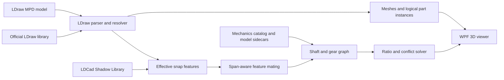

# TechnicsSimulator

TechnicsSimulator is an experimental kinematic simulator for LEGO Technic models stored in the [LDraw](https://www.ldraw.org/) format.

Most LDraw applications stop at rendering. This project aims to go further: infer axles, bearings, keyed connections, shafts, and gear meshes from model geometry, then propagate rotation through the reconstructed drivetrain with explainable gear ratios.

> [!IMPORTANT]
> Phases 0 through 4 are complete. The viewer reconstructs reviewed shaft and gear graphs, solves exact signed ratios for multiple drivers, explains conflicts, and animates the validated 8275 drivetrain while unsupported mechanisms remain static.

## Project goals

The first useful release will:

- Load and render the three supplied MPD models efficiently.
- Inspect logical parts, connection features, shafts, bearings, and candidate gear meshes.
- Explain where each inferred connection came from and how confident it is.
- Let the user choose a driving shaft or motor output.
- Animate reviewed rotary gear paths with exact, auditable ratios.
- Clearly identify ambiguous and unsupported mechanisms instead of silently guessing.

This is initially a **kinematic** simulator. It will model positions and velocity relationships, not mass, torque, friction, gravity, backlash, or material deformation.

## How it is intended to work



LDraw type-1 references contain transforms and geometry names, but they do not say which axle drives which gear. The [LDCad Shadow Library](https://github.com/RolandMelkert/LDCadShadowLibrary) adds snapping metadata for many official parts. TechnicsSimulator will combine that metadata with a reviewed mechanics catalog and optional per-model corrections.

Automatic inference is deliberately conservative. For example, an axle-shaped shaft in an axle-shaped hole is a high-confidence keyed connection, while a round pin in a round hole may be either structural or an intentional hinge.

## Supplied models

The repository includes four LDraw MPDs in [Models/](Models/):

| Model | MPD sections | Source type-1 lines | Expanded logical parts | Notable mechanisms |
| --- | ---: | ---: | ---: | --- |
| 8275 Motorized Bulldozer | 157 | 3,021 | 3,029 | Four motors, gears, worms, clutches, universal joints, sprockets, tracks |
| 42055 Bucket Wheel Excavator | 79 | 4,385 | 3,928 | Motor, dense gearbox, worm, clutch gears, changeover catches, turntables, one rack, hoses |
| 42100 Liebherr R 9800 | 186 | 8,655 | 7,279 | Gears, turntables, universal joints, linear actuators, tracks |
| 42121 Heavy-Duty Excavator | 57 | 1,215 | 576 | Gears, universal joints, linear actuators, tracks |

The distinction between source lines and logical parts matters, and it runs in both directions. The 8275 MPD embeds an unofficial LS70 track-link part and uses it 1,630 times; recursively expanding that part's rendering primitives produces tens of thousands of references, but those primitives are not separate LEGO parts. The 42xxx MPDs go the other way: their section lists include embedded parts and primitives, so they contain more source type-1 lines than the model has actual parts.

8275 is the reference drivetrain for the MVP because it has the most motors and the clearest worm-driven path. It is not the only motorized model: 42055 has one Power Functions XL motor too.

## MVP scope

Planned for the first release:

- LDraw MPD/LDR/DAT parsing and library resolution.
- Solid rendering, colors, BFC handling, caching, instancing, and part selection.
- LDCad shadow overlay and inherited snap-feature extraction.
- Axial-span-aware connection matching.
- Shaft reconstruction and bearing/keyed-connection diagnostics.
- Spur, bevel, crown, and worm gear constraints.
- Multiple driver inputs, exact tooth ratios, and closed-loop conflict reporting.
- One hand-verified, end-to-end 8275 drivetrain demonstration.

Explicitly deferred:

- Moving track loops and flexible hoses.
- Spring, suspension, and general linkage pose solving.
- Rack-and-pinion translation and linear actuators.
- Differential equations.
- Exact articulated universal-joint animation.
- Torque-dependent clutch slip and worm self-locking.
- Rigid-body dynamics, collision response, and structural stress.

Unsupported mechanisms will remain static and be labeled in the UI.

## Planned architecture

The implementation targets .NET 8 and Windows WPF:

```text
src/TechnicsSim.LDraw/       Parsing, file sources, transforms, colours, geometry  [exists]
src/TechnicsSim.Mechanics/   Snap features, matching, catalog, graph, solver       [exists]
src/TechnicsSim.Wpf/         Helix-based viewer and diagnostics UI                 [exists]
tools/TechnicsSim.Cli/       Coverage reports and graph diagnostics                [exists]
tests/TechnicsSim.Tests/     Fixtures, golden reports, and integration tests       [exists]
tests/TechnicsSim.Wpf.Tests/ Selection mapping, axis conversion, scene batching    [exists]
```

Report building lives in the core library rather than the CLI, so the command line and the eventual diagnostics UI cannot drift into emitting different numbers for the same model.

The renderer sits behind `ISceneRenderer`, so no HelixToolkit type reaches the view model, the mechanism code, or the tests. The LDraw-to-renderer axis change lives at exactly one documented boundary (`LDrawAxes`) and is a rotation rather than a mirror, because a mirror would invert every face and quietly undo the BFC work done while building meshes.

The renderer is planned around [HelixToolkit.Wpf.SharpDX](https://www.nuget.org/packages/HelixToolkit.Wpf.SharpDX/3.1.2). Core parsing and mechanics will remain independent of WPF so they can be tested and used from the CLI.

See [PLAN.md](PLAN.md) for the reviewed technical design, delivery gates, data model, known pitfalls, and test strategy.

## Development status

- [x] Collect representative LDraw models.
- [x] Audit MPD structure and logical instance counts.
- [x] Review LDraw and LDCad shadow semantics.
- [x] Write the implementation and verification plan.
- [x] Establish the external shadow-library source and revision.
- [x] Phase 0: solution, resolver, permanent audit CLI, and library bootstrap.
- [x] Phase 1: loader and visual vertical slice.
- [x] Phase 2: shadow features and connection diagnostics.
- [x] Phase 3: mechanics catalog, sidecars, and shaft graph.
- [x] Phase 4: solver and first validated drivetrain animation.

## Getting started

```powershell
./scripts/bootstrap-libraries.ps1          # fetch the shadow library, locate a parts library
dotnet build
dotnet test
```

Run the viewer:

```powershell
dotnet run --project src/TechnicsSim.Wpf
```

It opens the reviewed 8275 demonstration by default and lets you orbit, select parts, and inspect the tree. Right-drag rotates, middle-drag pans, and the mouse wheel zooms; left-click selects. Clicking a part shows its full hierarchical instance ID, shaft, and solved ratio where applicable, while the tree and viewport select each other. The animation toolbar is always visible: choose one or all reviewed drivers, or select any gear/shaft member and click **Drive selection** to make that shaft a temporary input, then use Play or scrub one input-shaft turn. The **Solution** tab displays the driver-rooted solved graph, every gear constraint, exact conflicts, and unsolved shafts; clicking any of them highlights and frames its parts. `--model <path>`, `--diagnostics`, and `--edges` set the startup state so a specific view can be reproduced without clicking through the UI.

Audit a model from the command line:

```powershell
dotnet run --project tools/TechnicsSim.Cli -- library-info
dotnet run --project tools/TechnicsSim.Cli -- inspect-model "Models/8275-1.mpd"
dotnet run --project tools/TechnicsSim.Cli -- coverage "Models/8275-1.mpd" --json reports/8275.json
dotnet run --project tools/TechnicsSim.Cli -- mesh-stats "Models/8275-1.mpd"
dotnet run --project tools/TechnicsSim.Cli -- connections "Models/8275-1.mpd" --json reports/8275-connections.json
dotnet run --project tools/TechnicsSim.Cli -- shafts "Models/8275-1.mpd" --json reports/8275-shafts.json
dotnet run --project tools/TechnicsSim.Cli -- solve "Models/8275-1.mpd" --json reports/8275-solution.json
```

`library-info` prints the exact parts-library revision and shadow commit every other report depends on. `inspect-model` summarizes sections, the three instance counts, and any resolution failure. `coverage` adds shadow-feature availability per part, weighted by instance count. `mesh-stats` builds the whole render scene headlessly and reports batching, instancing, and triangle counts, so rendering claims can be checked in CI rather than eyeballed.

`connections` replays effective shadow patches through the official part tree, places finite snap sections on logical instances, and emits span-aware mate candidates. Its JSON includes residuals, confidence, ambiguities, rejected scale/mirror inheritance, and the shadow line plus transform chain behind every feature. In the viewer, enable **Diagnostics** to see feature axes and section profiles; cyan is matched, orange unmatched, magenta ambiguous, and green lines mark unambiguous mate candidates. Selecting a part shows the named rule and residuals behind its first candidate.

`shafts` builds the rotary graph: it grows shaft assemblies from keyed connections only, mounts catalogued gears onto them, and proposes meshes with exact rational ratios. Every mesh reports tooth counts, the measured and predicted centre distance, the residual between them, face overlap, confidence, and the rule that produced it. Mechanisms the MVP will not solve — clutches, universal joints, turntables, sprockets, racks, and linear actuators — are listed as boundaries with the reason propagation stops, rather than being dropped or silently meshed.

`solve` applies the reviewed driver inputs to that same graph and propagates signed ratios as reduced fractions. Use `--driver <instance-id>` to isolate one motor. Its text and JSON reports include each solved shaft's exact velocity and path length, every unsolved shaft, and both derivation paths for a conflicting loop or driver assignment. On 8275, the reviewed four-driver configuration consistently solves 15 of 109 shafts; the validated medium-motor path reaches its worm wheel at `+1:72` after four gear meshes.

Mesh direction is never assumed. The sign comes from a contact-frame calculation, so it stays correct when a shaft axis happens to be stored the other way round; real 8275 geometry contains both orientations.

Exit codes are `0` for success, `1` for a configuration or usage error, `2` when a model has unresolved references, `3` when a sidecar override no longer matches the model it annotates, and `4` when exact drivetrain constraints conflict.

## Mechanics catalog and model sidecars

The shadow library describes connection geometry, not tooth counts, pitch surfaces, motor outputs, or clutch behaviour. Two committed data layers supply the rest.

[data/parts-mechanics.json](data/parts-mechanics.json) holds reusable part semantics for every drivetrain-relevant part in the four models. Every entry is attributed, and a test derives the toothed-part set from official LDraw descriptions and fails when a model uses one the catalog has missed, so adding a model surfaces the gap rather than skipping it.

Two values in it were measured rather than assumed. Gear rotation axes come from each part's keyed axle feature, because gear parts do not share a local convention — 3647 lays its axle hole along Z while others use Y. The worm's pitch radius is 10 LDU, measured from the 8275 worm and 24-tooth pair sitting 40 LDU apart, which cross-checks against the module: 10 LDU is exactly the 8-tooth envelope, and `(8 + 24) * 1.25 = 40`, which is why a worm drops into 8-tooth spacing.

`Models/<model>.mechanics.json` holds reviewed, model-specific corrections: ground selection, accepted or rejected mates and meshes, shaft joins and splits, clutch engagement, drivers, and unsupported annotations. Every override carries a reason, so the file records a review rather than unexplained tweaks.

Overrides are fingerprinted by part name and rounded world position. Instance IDs encode positions in the model tree, so editing a model can silently repoint an ID at a different part, and a stale override is worse than a missing one because it still looks reviewed. Mismatches are reported against both the recorded and current values.

The **Mechanics** tab in the viewer edits all of this directly — accept or reject meshes, set clutches locked or free, name drivers — and exports the same file the CLI reads. Selecting any row highlights that instance in the 3D view and the model tree.

## External data setup

The official parts library and shadow library are intentionally not committed because they are independently maintained datasets. `scripts/bootstrap-libraries.ps1` sets both up and prints the revisions in use; the rest of this section describes what it does.

### LDraw parts library

Tools accept any of the following, in this resolution order:

1. A path supplied through `--ldraw` or `TECHNICSSIM_LDRAW_PATH`.
2. A current `complete.zip` from the [LDraw library updates page](https://library.ldraw.org/updates), placed at `Library/complete.zip`, or an extracted tree at `Library/LDraw/`.
3. LeoCAD's `library.bin`, which is a ZIP containing an `ldraw/` tree.

ZIP sources are read in place, so a 480+ MB library never has to be extracted to inspect a few hundred parts. Run `./scripts/bootstrap-libraries.ps1 -Source Download` to fetch a current `complete.zip`; LeoCAD's snapshot works for local development but is not a tracked release.

### LDCad Shadow Library

The bootstrap script clones this into the ignored `Library/` directory. Manually:

```powershell
New-Item -ItemType Directory -Path Library -Force
git clone https://github.com/RolandMelkert/LDCadShadowLibrary.git Library/LDCadShadowLibrary
```

The project audit and the committed golden reports use shadow commit `15aa1e718b6a8da37d24fc7af5e52e262c041bfb` from 2026-03-15. Every report records the official-library version and shadow revision that produced it.

Do not commit `Library/`; it is covered by [.gitignore](.gitignore).

## Testing philosophy

The mechanics must be explainable and independently verifiable.

Implemented so far:

- Line-type, MPD-splitting, and header-classification fixtures.
- Nested matrix composition and color-inheritance fixtures, which lock multiplication order numerically rather than by visual inspection.
- Resolution ordering fixtures, including an MPD-local `.dat` that must outrank the official library.
- Cycle detection, stable hierarchical instance IDs, and shadow-meta field parsing.
- Baseline tests pinning all three MPDs to the audited section, line, instance, and part counts.
- Golden coverage reports per model, compared with source paths excluded so a diff means a real interpretation change.
- BFC fixtures: winding declarations, mid-file winding changes, `INVERTNEXT`, reflecting transforms, and the case where the two cancel.
- Colour fixtures covering inherited colour 16, edge colour 24, direct colours, and material clauses that must not overwrite a surface colour.
- Scene batching assertions: repeated parts collapse to one vertex buffer, colour variants share it, and uploaded triangles stay separate from drawn triangles.
- Selection mapping from a rendered instance index back to its hierarchical logical instance ID, and the axis conversion's handedness.
- Effective shadow inheritance with finite `SNAP_CYL`, clip, finger, and generic shapes; `SNAP_CLEAR`; non-recursive `SNAP_INCL`; centered/uncentered grids; and scale/mirror policies.
- Span-aware axle/bore mating, separate radial/axial/angular residuals, named confidence rules, same-instance exclusion, and explicit many-to-many ambiguity.
- CLI JSON provenance and viewer overlays for section profiles, axes, mates, unmatched features, and ambiguous candidates.

Planned:

- 8:24 and three-gear ratio fixtures with exact sign composition.
- Hand-checked ratios for the first animated 8275 drivetrain.

Tests that need the external libraries skip with an explicit reason when those are absent, so a clean checkout still runs the full fixture suite. Golden baselines are regenerated only with `TECHNICSSIM_UPDATE_GOLDEN=1`, never as a side effect.

Every inferred feature and constraint will retain provenance so the CLI and UI can answer why it exists.

## Contributing

The project is at the stage where design review and focused prototypes are especially valuable. Useful contribution areas include:

- LDraw resolution, BFC, and transform edge cases.
- LDCad shadow-meta interpretation and test fixtures.
- Technic gear, clutch, differential, and universal-joint semantics.
- Efficient WPF/DirectX instancing and selection.
- Small, physically verifiable drivetrain examples.

Before implementing a large subsystem, read [PLAN.md](PLAN.md) and open an issue describing the proposed scope and acceptance fixture. Keep external part libraries out of commits.

## Data, licensing, and trademarks

- The supplied MPD files retain their embedded author, history, and CCAL 2.0 license declarations.
- The LDCad Shadow Library is distributed separately under CC BY-SA 4.0 and requires attribution when its data or derivatives are distributed.
- The official LDraw library has its own contributor and redistribution terms.
- A project-wide software license has not yet been selected. Until one is added, the repository should not be assumed to grant general reuse rights for future source code.

LEGO is a trademark of the LEGO Group, which does not sponsor, authorize, or endorse this project. LDraw is an independently maintained community format.

## References

- [LDraw file-format specification](https://www.ldraw.org/article/218.html)
- [LDraw BFC extension](https://www.ldraw.org/article/415.html)
- [Official LDraw library updates](https://library.ldraw.org/updates)
- [LDCad Shadow Library](https://github.com/RolandMelkert/LDCadShadowLibrary)
- [LDCad meta documentation](https://www.melkert.net/LDCad/tech/meta)

